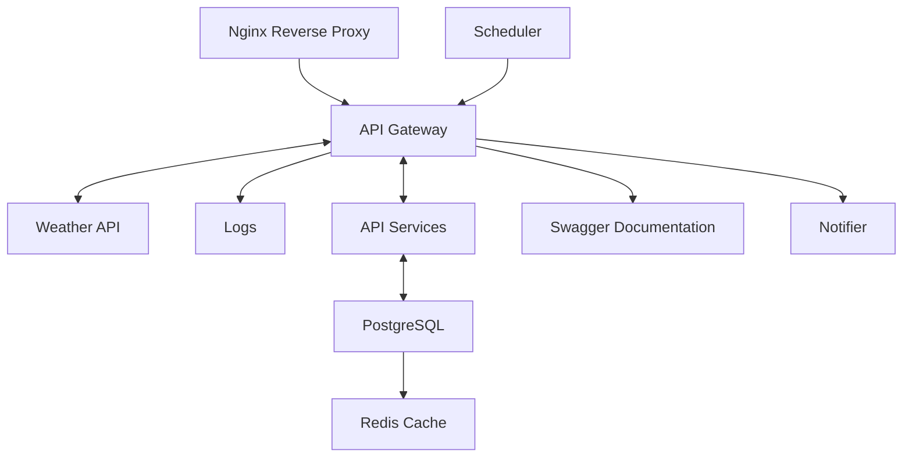

# Weather API Application System Design

## 1. System Requirements

### Functional Requirements

- Provide real-time weather data upon request for a specific city.
- API for managing subscriptions: subscribe, confirm, and unsubscribe.
- Send email notifications: hourly or daily weather updates.
- Automatically delete unconfirmed subscriptions after 5 minutes.
- Simple, intuitive, and responsive frontend for interacting with the API.

### Non-Functional Requirements

- **Availability:** System must be available at least 99.9% of the time.
- **Scalability:** Handle up to 1000 requests per second (RPS).
- **Performance:** API response time < 100 ms.
- **Documentation:** All API functionality must be documented.
- **Security:** All API requests must use secure HTTPS connections.
- **Logging:** Implement structured logging for all services.
- **Storage:** Reserve at least 100 GB for storing subscription data and system logs.
- **Testing:** Core services must have at least 90% test coverage.
- **CI/CD Integration:** All changes must pass through an automated CI/CD pipeline with style checks, testing, and builds.

### Constraints

- **Budget:** Minimal plan for deployment on Google Cloud and use of a free Weather API.
- **External API Limitation:** 1000 requests per hour.
- **Compliance:** Handle personal data (email) in accordance with GDPR.

---

## 2. Load Estimation

### Users and Traffic

- **Active Users:** 40,000
- **Subscriptions per User:** Average of 5 subscriptions per email
- **Peak Load:** 100,000 requests
- **API Requests:** 1000 RPS (peak)

### Data

- **User Data:** 500 bytes (subscription data: email, city)
- **Weather Data:** 2 KB per request (temperature, humidity, description)
- **Weather Data Cache:** 2 KB per city
- **Total Size:** 100 GB/year (logs, subscriptions)

### Bandwidth

- **Inbound:** 5 Mbps (subscription and weather data requests)
- **Outbound:** 10 Mbps (email notifications, API responses)
- **External API:** 50 Mbps (Weather API)

---

## 3. High-Level Architecture

---

## 4. Detailed Component Design

### 4.1 API Service (Node.js/NestJS)

**Responsibilities:**
- Handle REST API requests.
- Validate data.
- Perform CRUD operations for subscriptions.

**Access:** http://35.207.129.35:3000

**Endpoints:**
- `GET /api/v1/weather?city={city}` — Retrieve weather data for a city.
- `GET /api/v1/confirm/{token}` — Confirm a subscription.
- `GET /api/v1/unsubscribe/{token}` — Unsubscribe from notifications.
- `GET /api/v1/docs` — Access API documentation.
- `POST /api/v1/subscribe` — Create a new subscription.

**Scaling:**  
Horizontal scaling via Docker.

---

### 4.2 Scheduler

- **Library:** `@nestjs/schedule`
  - Send weather updates (hourly/daily)
  - Delete unconfirmed subscriptions (TTL: 5 minutes)

---

### 4.3 Notifier (Nodemailer)

- **Library:** ```@nestjs-modules/mailer```
  - Send emails for subscription confirmation, unsubscription, and weather updates.

---

### 4.4 Weather API Integration

- **Caching Strategy:**
  - **L1 Cache (Redis):** 5-minute TTL for weather data.
  - **Fallback:** Direct request to Weather API if cache is empty.

---

### 4.5 Documentation

- **Library:** ```@nestjs/swagger```
- **Access:** http://35.207.129.35:3000/api/docs
  - Interactive REST endpoint documentation.
  - Ability to test requests directly from the browser.
  - Automatically generated from NestJS decorators.

---

### 4.6 Database Design

**PostgreSQL Schema:**

- **Table:** `subscription`
  - `subscription_id` (int, primary key, auto-increment)
  - `email` (string) — User's email
  - `city` (string) — City for subscription
  - `frequency` (enum: hourly, daily) — Update frequency
  - `confirmed` (boolean, default: false) — Subscription confirmation status
  - `createdAt` (timestamp, default: now()) — Record creation time
  - `updatedAt` (timestamp, auto-updated) — Record update time
  - **Unique Constraint:** email + city (to prevent duplicate subscriptions)

- **Table:** `token`
  - `token_id` (int, primary key, auto-increment)
  - `token` (string) — Unique token for confirmation or unsubscription
  - `subscription_id` (int, foreign key to subscription.subscription_id)
  - `createdAt` (timestamp, default: now()) — Token creation time
  - `expiresAt` (timestamp, nullable) — Token expiration time

**Redis Keys:**
- `weather:{city}`: Cached weather data (TTL: 5 minutes)
- `location:{city}`: Cached invalid location data (TTL: 5 minutes)

---

### 4.7 Security and Compliance

- **Secret Management:** Store `WEATHER_API_KEY`, `EMAIL_USER`, and `EMAIL_PASSWORD` in `.env` and GitHub Secrets.
  - Support unsubscription via `GET /api/unsubscribe/{token}`
  - Delete unconfirmed subscriptions after 5 minutes.
- **TLS:** Deployed on Google Cloud with SSL tied to IP (35.207.129.35).

---

### 4.8 ORM Layer — Prisma

- Type-safe database client for PostgreSQL.
- Model database schema using Prisma schema definition language.
- Generate client code for clean and efficient CRUD operations.
- Integrate with NestJS for dependency injection.
- Simplifies migrations and schema management.

---

### 4.9 Logging

- **Library:** ```nestjs-pino```
- Structured, fast JSON logging for all services.
- Supports log levels, request tracing, and performance metrics.
